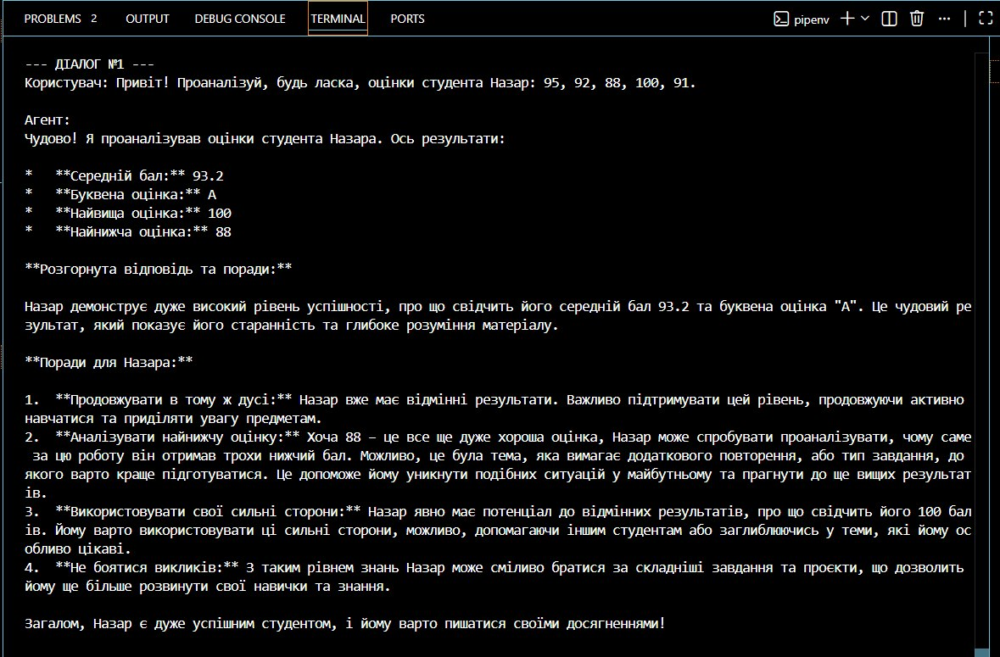
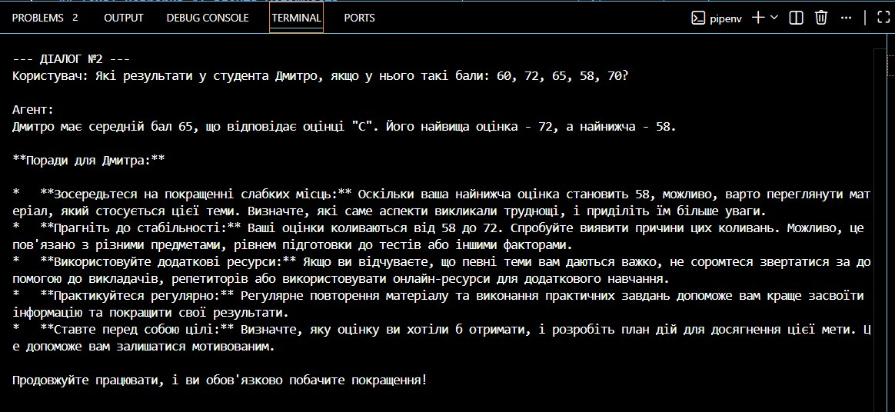
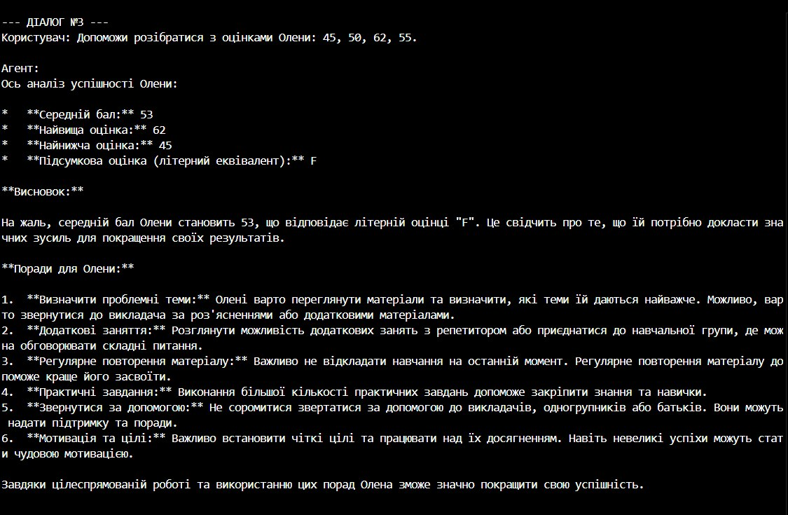

# Звіт про виконання екзаменаційного завдання (Варіант 4)
## Тема: Розробка AI-агента успішності студентів на основі об'єктно-орієнтованого програмування

---

### 1. Мета роботи
Ознайомитися з принципами розробки інтелектуальних агентів за допомогою сучасних моделей штучного інтелекту, реалізувати бізнес-логіку системи обліку успішності за допомогою чотирьох парадигм об'єктно-орієнтованого програмування (ООП) на мові Python та інтегрувати її як інструмент (tool) для AI-агента.

---

### 2. Завдання роботи
1. Реалізувати ієрархію ООП-класів: абстрактний клас `Person`, класи `Student` та `Teacher`.
2. Забезпечити інкапсуляцію оцінок у приватному списку `__grades`.
3. Створити функцію-інструмент `calculate_grade` для розрахунку статистики успішності.
4. Сформувати змістовний системний промпт для ШІ-агента як освітнього асистента.
5. Продемонструвати роботу агента на 3 різних наборах даних студентів.

---

### 3. Теоретичні відомості

Для побудови логіки програми було застосовано **4 основні парадигми ООП**:

* **Абстракція:** Створення базового класу `Person` за допомогою модуля `abc`. Він визначає загальну структуру для всіх суб'єктів навчального процесу (ім'я, вік) та містить абстрактний метод `get_role()`, який зобов'язує всі дочірні класи реалізувати власну логіку.
* **Успадкування:** Класи `Student` та `Teacher` наслідують властивості та конструктор базового класу `Person` за допомогою ключового слова `super()`, що дозволяє уникнути дублювання коду.
* **Інкапсуляція:** Список оцінок `self.__grades` є приватним (захищеним подвійним підкресленням). Прямий доступ до нього ззовні закритий. Взаємодія з оцінками, їхня валідація (в межах 0-100) та математичні розрахунки відбуваються виключно через публічні методи класу.
* **Поліморфізм:** Метод `get_role()` перевизначений в обох дочірніх классах. Для об'єкта студента він повертає рядок `"Студент"`, а для викладача — динамічний рядок із назвою його предмету.

---
### 5. Результати роботи програми та вихідні файли

#### 📂 Посилання на файли проекту:
* [Вихідний код програми (agent.py)](./agent.py) — містить ООП-структуру класів та логіку виклику інструментів ШІ.
* [Конфігураційний файл середовища (.env)](./.env) — містить зашифрований API-ключ доступу до Gemini API.
* [Файл ігнорування версій (.gitignore)](./.gitignore) — забезпечує безпеку та блокує витік файлу `.env` у репозиторій.

#### 📸 Скріншоти виконання тестових запитів:

##### Діалог №1 (Аналіз успішності студента Назар)

##### Діалог №2 (Аналіз успішності студента Дмитро)

##### Діалог №3 (Аналіз успішності студентки Олени)
