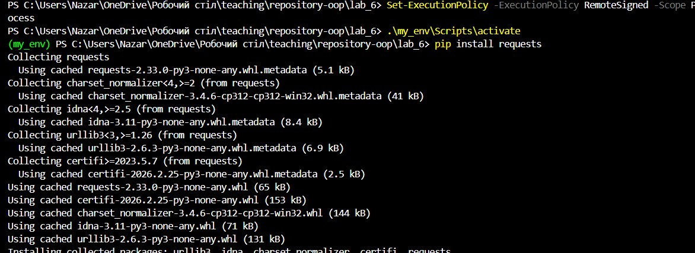
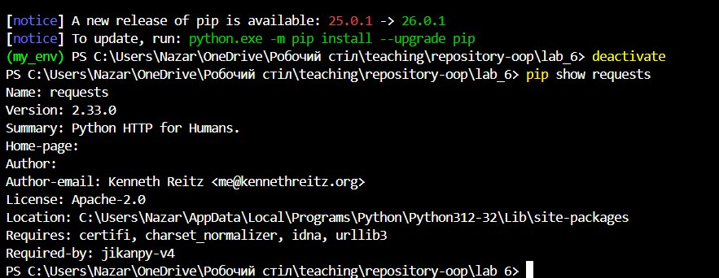
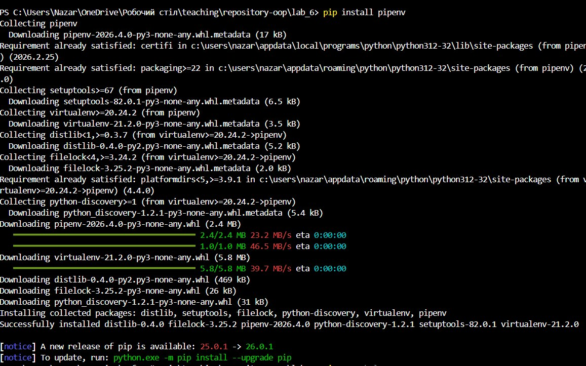
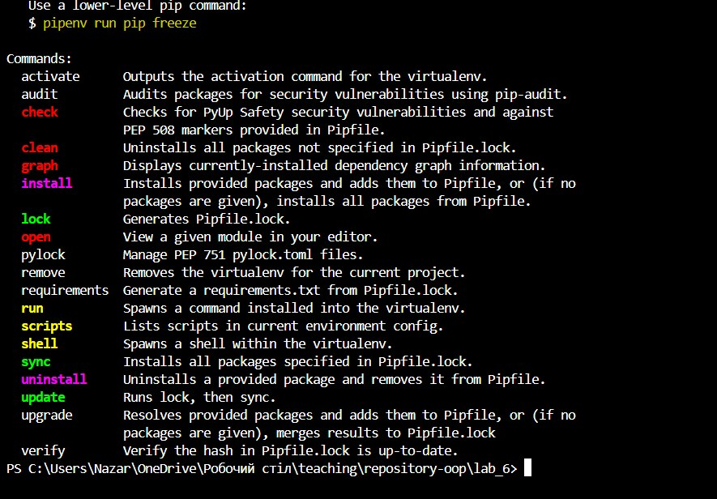
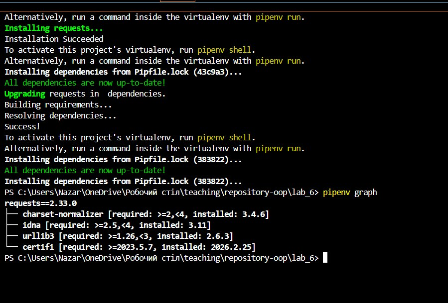
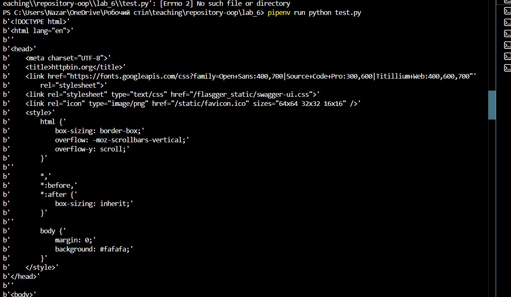
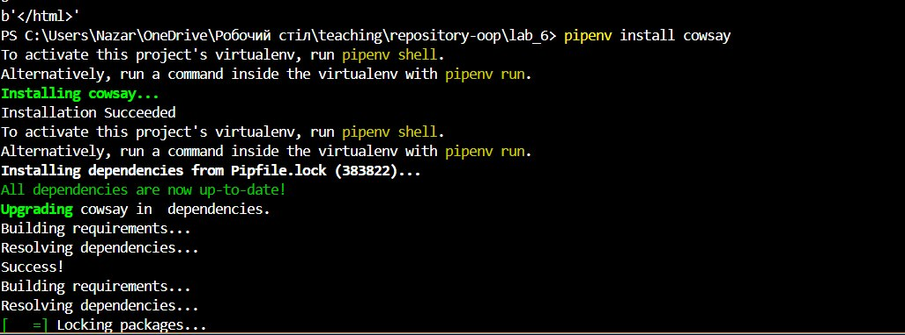

## Звіт до  лабораторної роботи номер 6
## Тема: Віртуальні середовища
## Мета: навчитись працювати з віртуальними середовищами та бібліотеками
## Виконання завдань:
#### Основи роботи з сторонніми бібліотеками
1. Перевірив чи він встановлений на компютері(pip)

2. Перевірbd які бібліотеки вже інстальовані ось фото 

3.Встановив бібліотеку requests: 

4.Ознайомився які ще методи є в бібліотеці requests, та використав:

5.Виконав завдання під номером 7: 

6.Поекспериментував з бібліотекою jikanpy , створив файл для виконання завдання та виконав усі необхідні приклади для цієї вправи ось фото:
 та результат  а також посилання на сам файл [ось посилання](anime.py)

7.Попробував знайти які аніме серіали виходять у цьому сезоні та вивів їх оцінки за допомогою бібліотеки jikanpy: ось посилання на файл із виконаним завданням  та [посилання на сам файл](season.py)

### Робота у віртуальному середовищі

1.Створив VENV та його активації  та виконав команди згідно завдання : ось фото  і інші завдання також ось фото 

2. Виконав також інші завдання [посилання на сам файл](lab6.env)

### Робота з Pipenv

1. Інсталював Pipenv ось фото 

2. Команди можна виконувати за допомогою pipenv:
ось фото 

3. Також виконав інші завдання з Pipenv ось фото 

4. Запустив програму з Visual Studio. Запустіть програму з командної стрічки. Запустіть програму зайшовши у віртуальне середовище за допомогою команди pipenv shell: [посилання на сам файл](test.py) 

5. Програму успішно запущено за допомогою команди pipenv run. Це дозволило виконати HTTP-запит до httpbin.org та отримати відповідь у вигляді HTML-коду без необхідності вручну активувати середовище. ось фото 

6. Інсталював нову бібліотеку pip ось фото
  а також виконав завдання з нею[ посилання на сам файл](/fun.py)  та результат  

7. Запустив flake8 для перевірки коду ось фото

8. Виконав завдання для виявлення вразливостей у залежностях - це важливий аспект безпеки програмного забезпечення ось фото 

9. Також перевірив на вразливість за допомогою
pipenv check --scan ось фото 

### Робота зі змінними середовища
1. Параметрезував середовище за допомогою змінних ось фото 

2. Що буде якщо виконати скрипт без активації віртуального середовища?

Відповідь:

  —  Програма видасть помилку KeyError: 'IT_TEST'.

 — Чому: Бо без Pipenv твоя операційна система (Windows) нічого не знає про файл .env. Ці змінні існують лише всередині твого віртуального контейнера.

 — Навіщо це треба? : Це безпека. Твої ключі та паролі доступні лише програмі, коли вона запущена у правильному середовищі, і не "світяться" в системі.

### Робота з Poetry

1.Встановив poetry та виконав інші завдання ось фото   і також ось

  

 2. Для детального перегляду залежностей з їхніми версіями та описами використав poetry show --tree ось фото : 

 3. Щоб видалити залежність з проєкту, використав команду:
poetry remove <package_name> ось фото 

4. Щоб оновити всі залежності до їхніх останніх сумісних версій, використав команду:
poetry update ось фото 

5. За допомогою АІ створив програму для цього проекту та запустіть її у віртуальному середовищі створеному а допомогою poetry: ось фото  та [ посилання на сам файл](poetry_check.py)

### Допомога ChatGPT

1. За допомогою ChatGPT написав простий web сайт з використанням бібліотеки Flask яку потрібно встановити у віртуальному середовищі а також використати код програми написаний у попередніх завданнях цієї роботи як вивід для однієї з веб сторінок ось фото   та результат 
  
[ посилання на сам файл](/app.py)

## Висновок:

- В даній роботі я працював з віртуальним середовищем та виконував поставлені завдання
- Мету роботи досягнено
- Здобував навички програмування з ООП
- В ході роботи питань не виникло
- Вдалось виконати усі завдання
- Складнощів не виникало