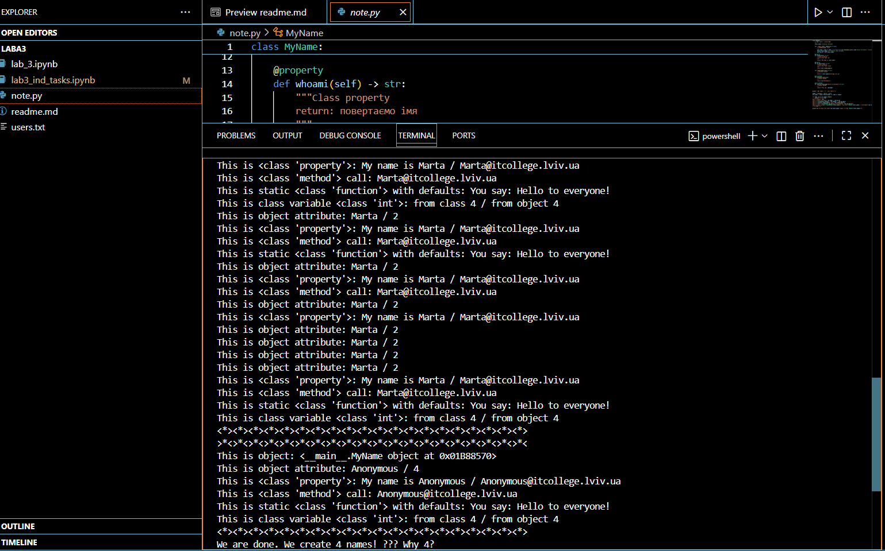
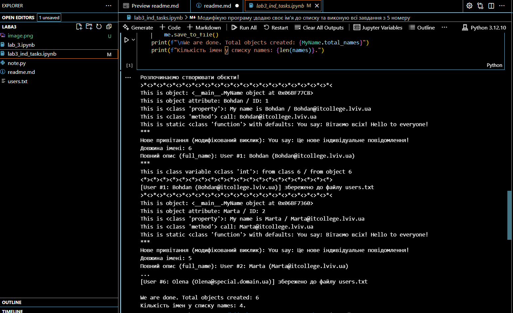
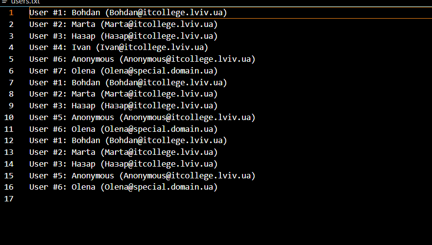

# Лабораторна робота №3
***Тема***: Знайомство з ООП
>***Мета***:Навчитись використовувати основні принципи ООП, розглянути конструкції побудови класу та створення об'єктів та навчитись працювати з ними.

Хід роботи 

На цій лабораторній роботі я розробив такі програми,також виконав приклади з лекцій в окремому файлі ось посилання на кожен із них :

-  [lab3_ind_tasks.ipynb](/lab3_ind_tasks.ipynb)
- [lab_3.ipynb](/lab_3.ipynb)
- [note.py](/note.py)

## Місце для скріншотів

Тут додаю скріншоти виконання кожної з програм:

- **note.py**:

---

- **lab3_ind_tasks.ipynb**:

---
- **users.txt**:

## Висновок :
- на цій лабораторній роботі я навчився використовувати основні принципи ООП, розглянув конструкції побудови класу та створення об'єктів та навчитвся працювати з ними.
 - створив окремий файл у якому виконав приклади з лекцій 
 - модифікував програму додавши своє ім'я в список та виконав всі завдання з 5 номеру
 - Вдалось виконати всі завдання, труднощі у виконанні не виникали
 - сподобався такий формат здачі роботи 
